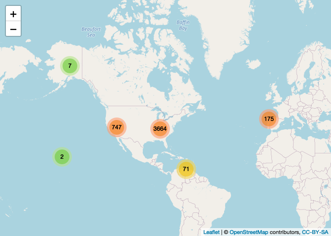

columbine
================

Access data from [Mass Shooting
Trakcer](https://massshootingtracker.site/) from R.

### Requirements

\+[R v4.1+](https://www.r-project.org/)
+[rlang](https://CRAN.R-project.org/package=rlang)
+[dplyr](https://CRAN.R-project.org/package=dplyr)
+[jsonlite](https://CRAN.R-project.org/package=jsonlite)
+[rappdirs](https://CRAN.R-project.org/package=rappdirs)
+[tidygeocode](https://CRAN.R-project.org/package=tidygeocode)
+[sf](https://CRAN.R-project.org/package=sf)

### Installation

    remotes::install_github("btupper/columbine")

### Fetching and Geocoding data

Fetching can be done by a single year, or multiple years. Geocoding
takes a bit of time, but once complete reading the files is quite fast.

``` r
suppressPackageStartupMessages({
  library(columbine)
  library(dplyr)
  library(leaflet)
})

# commented out so that it doesn't run repeatedly, uncomment to run
# xx <- fetch_data(seq(from = 2013, to = current_year(), by = 1))
```

### Read in the data

``` r
x <- read_data(form = "sf")
x
```

    ## Simple feature collection with 4666 features and 5 fields
    ## Geometry type: POINT
    ## Dimension:     XY
    ## Bounding box:  xmin: -155.4284 ymin: 10.47494 xmax: -7.863112 ymax: 64.44596
    ## Geodetic CRS:  WGS 84
    ## # A tibble: 4,666 × 6
    ##    date       killed wounded city        state             geometry
    ##  * <date>      <dbl>   <dbl> <chr>       <chr>          <POINT [°]>
    ##  1 2013-01-01      1       3 Hawthorne   CA     (-118.756 36.70146)
    ##  2 2013-01-01      1       4 Lorain      OH    (-82.68814 40.22536)
    ##  3 2013-01-01      0       4 McKeesport  PA    (-77.72788 40.96999)
    ##  4 2013-01-01      2       3 Sacramento  CA     (-118.756 36.70146)
    ##  5 2013-01-05      4       0 Aurora      CO    (-105.6077 38.72518)
    ##  6 2013-01-07      4       0 Tulsa       OK    (-97.26841 34.95508)
    ##  7 2013-01-07      2       2 Greensboro  NC    (-79.03929 35.67296)
    ##  8 2013-01-07      3       1 Dinwiddie   VA    (-78.49277 37.12322)
    ##  9 2013-01-10      3       2 New Orleans LA    (-92.00713 30.87039)
    ## 10 2013-01-19      5       0 Albuquerque NM     (-105.993 34.57082)
    ## # … with 4,656 more rows

### Quickly plot the data

``` r
total_shot <- x$killed + x$wounded
range_shot <- range(total_shot, na.rm = TRUE)
sz <- ((total_shot - range_shot[1])/(range_shot[2] - range_shot[1]) + 1) * 5
leaflet(data = x) |>
  addTiles() |>
  addCircleMarkers(radius = sz, clusterOptions = markerClusterOptions())
```

<!-- -->
